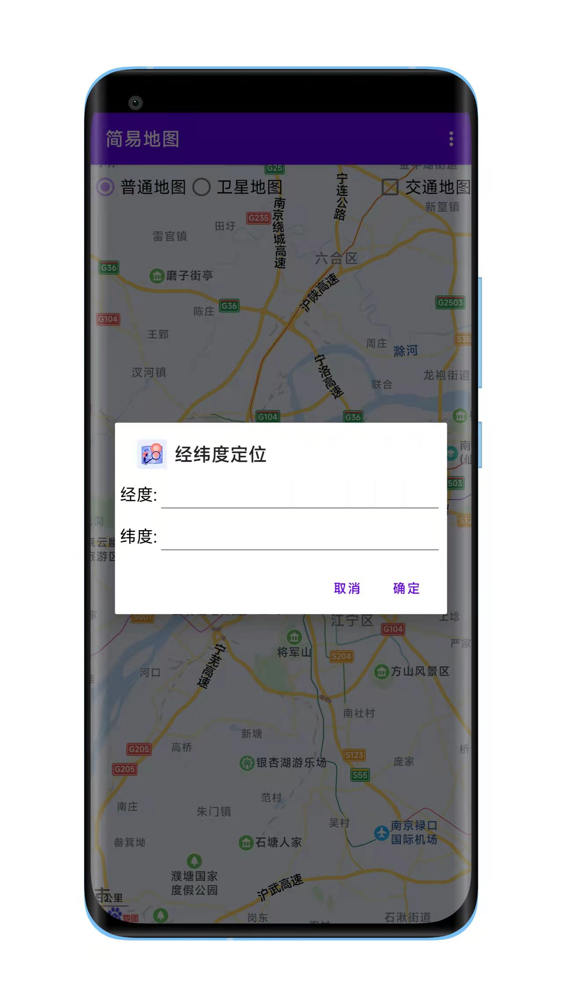

# SimpleMap
A BaiduMap SDK android demo program.

### Main Pages
- Index

- Login/Register Operation

- Location Operation

- Map Operation

Addition Pages

- Register

- City Location

- Distance Calculation

### Reference

[BaiduMap SDK](https://lbsyun.baidu.com/index.php?title=androidsdk/guide/create-project/androidstudio)